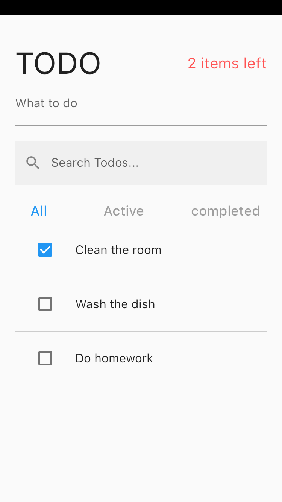

# Flutter Todo App

A simple and basic Flutter todo app showcasing the use of BLoC pattern.

## Features

* Add, edit, and remove todo items
* Filter todo items by completed status
* Search for todo items by description
* Display the number of active todo items

## Getting Started

1. Clone or download the repository.
2. Install the dependencies using `flutter pub get`.
3. Run the app using `flutter run`.

## Blocs

The app uses several BLoCs to manage the state and logic of the todo list.
* `FilterdTodosBloc`: Calculates the filtered list of todo items based on the current filter and search term.
* `ActiveTodoCountBloc`: Tracks the number of active (uncompleted) todo items.
* `TodoFilterBloc`: Handles changes to the filter selection.
* `TodoListBloc`: Handles CRUD operations on the todo list.
* `TodoSearchBloc`: Handles search operations on the todo list.

  

